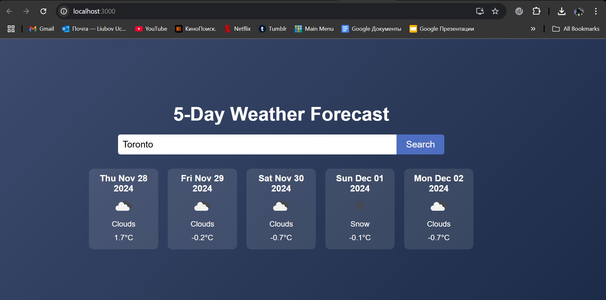

# Weather App

This is a simple weather app built with ReactJS that uses the OpenWeatherMap API to display weather forecasts.

## Features:
- Displays current weather conditions and 5-day forecast.
- Allows users to search for a city.
- Shows weather icons based on conditions.

## Setup Instructions:
1. Clone the repository.
2. Install dependencies using `npm install`.
3. Run the app with `npm start`.

